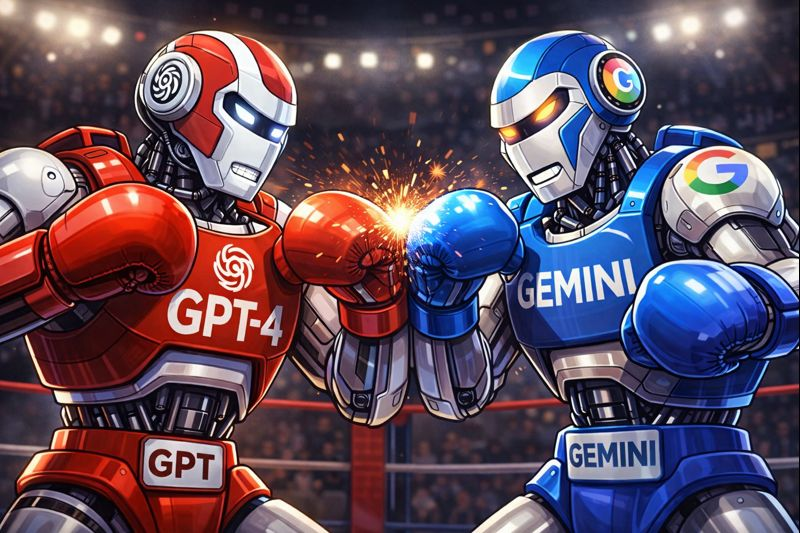

# LLM-based Data Enrichment

This project evaluates the use of LLMs via the OpenAI API (GPT models) and Google Gemini API for CPS devices enrichment, focusing on device type classification and operating system inference under uncertainty.

<p align="left">
  
</p
  
---

## What is a CPS Device Inventory?

A **CPS (Cyber-Physical Systems) device inventory** is a structured record of physical assets that combine computation, networking, and real-world control or sensing. In operational technology (OT) and industrial environments, such inventories typically include devices such as PLCs, HMIs, industrial PCs, medical devices, building controllers, power equipment, and network appliances. Unlike traditional IT inventories, CPS inventories often lack standardized metadata, have inconsistent naming conventions, and provide limited visibility into device roles or operating systems. As a result, enrichment of CPS inventories is a critical prerequisite for security monitoring, risk assessment, vulnerability management, and incident response in OT and mixed IT/OT environments.

---
## Project Overview

This project explores the use of **Large Language Models (LLMs)** for enriching CPS asset inventories with structured, security-relevant metadata, focusing on:

- Device type classification  
- Operating system (OS family) inference  

For each **device type** and **operating system** classification, the pipeline additionally assigns a **confidence level** and a **short justification**, enabling interpretable and analyst-friendly enrichment results.

The pipeline compares **GPT (OpenAI)** and **Gemini (Google)** on the same CPS dataset and evaluates their behavior in terms of coverage, confidence usability, and inter-model agreement.  
The comparative analysis is performed **only for the OS family classification**, as device type enrichment is carried out using a single model.

Numerical results are intentionally not reported, as repeated runs of LLM-based enrichment exhibit inherent variability that can lead to run-to-run differences.

---

## Project Structure

```text
├── assets/        # Visual artifacts used in README
├── notebooks/     # Exploratory analysis and demonstration notebook
├── src/           # Modular, production-style enrichment pipeline
├── data/          # Input CSVs (ignored in git)
├── output/        # Enriched outputs and evaluation artifacts (ignored in git)
├── README.md
├── requirements.txt
├── .env.example
```

---

## Methodology & Results

### 1. Device Type Enrichment

- Uses **product-family semantics** and industry naming conventions.
- Constrained to a **fixed, OT-aware taxonomy** to ensure inventory compatibility.

Each prediction includes the inferred **device type**, an associated **confidence level** (`low`, `medium`, `high`), and a **short justification** explaining the reasoning behind the classification.

The prompt was carefully structured to constrain the model’s role, output schema, and allowed vocabulary, ensuring consistent and interpretable classifications.

**Result:**  
Repeated executions showed minor variability in borderline categories (e.g., *Other* vs. a specific controller type), but **no devices shifted across high-level semantic domains** (e.g., medical ↔ industrial ↔ IT). High-confidence assignments remained stable across runs, indicating sufficient reliability for asset inventory enrichment workflows.

Overall, the resulting distribution is dominated by medically and operationally meaningful asset types, alongside core OT infrastructure components such as controllers, industrial computing platforms, and power-related devices. This aligns with the expected composition of a mixed CPS environment.

---

### 2. OS Family Enrichment

- Infers **OS family** (`Linux`, `Windows Embedded`, `VxWorks`, `Unknown`).
- Uses **device type as a contextual prior** rather than relying on model names alone.
- Produces **probabilistic inference** with confidence and justification.

**Result:**  
An initial prompt resulted in a large fraction of **Unknown** classifications. A refined prompt incorporating **industry OS priors** (e.g., HMIs → Windows Embedded, PLCs → RTOS-like systems) substantially improved coverage, approximately doubling the number of non-Unknown OS assignments for certain families.

Despite this improvement, *Unknown* remains prevalent, reflecting genuine ambiguity rather than model failure.
The same refined prompt was later used for Gemini-based OS enrichment.

---

### 3. Post-Enrichment Validation

To preserve reliability and prevent implausible assignments, a validation layer enforces **basic consistency rules** between device type and inferred OS family, including:

- **Industrial PCs** → Windows or Linux only  
- **PLCs** → never Windows  
- **HMIs** → rarely VxWorks  
- **Medical patient monitors** → rarely full Linux  

Classifications violating these constraints are conservatively downgraded to **Unknown**.

**Result:**  
No OS labels violated these constraints, indicating strong internal consistency of the enrichment process.

---

### 4. GPT vs. Gemini Comparison

The refined OS enrichment prompt was applied to both models under comparable conditions. For this comparison, three KPIs were evaluated: coverage rate (the proportion of classifications that were not Unknown), usable confidence rate (the proportion of classifications with medium or high confidence), and agreement rate between the two outputs.

**Key observations:**

- **Gemini** produced a substantially higher number of OS classifications (often roughly double) while exhibiting a reduced dominance of Unknown labels.
- **GPT** exhibits more conservative behavior, leaving a larger fraction of assets unclassified.

**Confidence distributions differ substantially:**

- Gemini outputs are concentrated around **medium-to-high confidence**.
- GPT produces a larger share of **low-confidence** predictions.

This difference reflects a **philosophical divergence rather than a technical one**:

- One model prioritizes broader coverage and assertive inference from weak signals.
- The other prioritizes caution and avoids over-commitment when evidence is limited.

Agreement rates between GPT and Gemini highlight a substantial subset of CPS assets whose OS characteristics are inherently ambiguous when inferred from model metadata alone. Disagreements are concentrated in edge cases and indicate assets that require conservative handling or further validation, rather than failures of either model.

Importantly, **higher confidence does not imply higher correctness** in the absence of ground truth. Usable-confidence metrics therefore measure **assertiveness, not accuracy**, a critical distinction in security inventories where false certainty can be costly.

---

## Execution & Security Notes

Gemini’s API exhibited intermittent overload behavior, occasionally resulting in failed or delayed responses. These runs were excluded from comparative evaluation to isolate model behavior from infrastructure instability.

During script-based execution, transient overloads were mitigated using retry logic and exponential backoff, aligning the pipeline with production-grade resilience practices.

API keys are supplied via environment variables and are **not embedded in code or notebooks.  
A `.env.example` file is provided to document required variables without exposing secrets.

---

## Key Takeaways

- LLMs can provide **robust, interpretable CPS inventory enrichment** when constrained by domain-aware prompts and validation rules.
- Device type enrichment is highly stable and well-suited for operational use.
- OS family enrichment remains probabilistic by nature, and confidence annotations are essential.
- Gemini-based enrichment resulted in approximately twice as many OS classifications compared to GPT-based enrichment.
- Differences between GPT and Gemini can indicate **inference philosophy**, not correctness.


